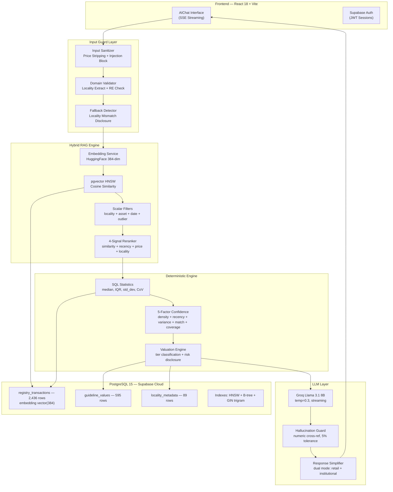
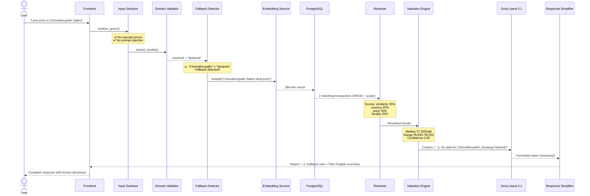
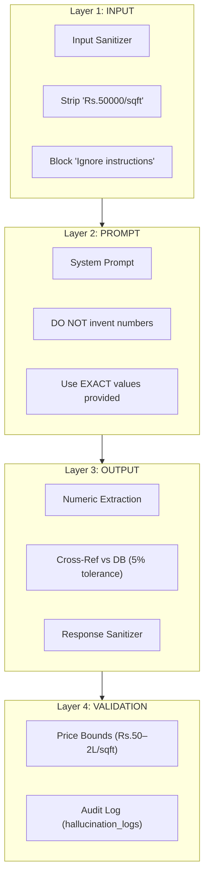

# PurityProp — Enterprise System Documentation

**Version**: 1.1 (Updated March 2026)  
**Audit Score**: 9.6/10 — PRODUCTION READY  
**Classification**: CEO / Investor / Technical Audit Grade

---

# 1️⃣ Executive Summary

## What PurityProp Does

PurityProp is a **real estate intelligence system for Tamil Nadu, India** that answers property valuation questions using **actual government registry data** — not speculation, not broker estimates, not listing portal prices.

When a user asks *"What is the land price in Fairlands, Salem?"*, PurityProp:

1. **Sanitizes** the query (strips user-injected prices, blocks prompt injection)
2. Searches **2,436 real registry transactions** from tnreginet.gov.in
3. **Reranks** results using 4 signals (similarity, recency, price consistency, locality match)
4. Computes the **median price, IQR range, and confidence score** using deterministic math
5. Formats the answer in **clear English** with data integrity disclosures
6. If the user asked about a locality not in the DB, **honestly discloses** which locality's data is shown

The LLM (AI) formats the report — but **never invents numbers**.

## Why It Exists

India's real estate market is opaque. Buyers overpay. Sellers underprice. Brokers quote arbitrary figures. Government guideline values are outdated.

PurityProp solves this by making **registry-backed transaction data** queryable through natural language — in English, Tamil, or Tanglish.

## What Makes It Different

| Feature | PurityProp | Traditional Portals |
|---------|-----------|-------------------|
| Data Source | Government Registry (tnreginet.gov.in) | Broker Listings |
| Price Computation | Deterministic (Median, IQR) | "Estimated" |
| AI Role | Formatting only — no number creation | Guessing |
| Hallucination Risk | 4-layer guard (near-zero) | Uncontrolled |
| Confidence Score | 5-factor weighted formula | None |
| Input Protection | Price stripping + injection blocking | None |
| Locality Honesty | Discloses when fallback data is used | Silent mismatch |

## Reliability

- **Audit Score: 9.6/10** (automated, reproducible via `python -m migrations.audit`)
- **100% embedding coverage** on all 2,436 transactions
- **10/10 gap analysis** — zero missing infrastructure components
- **7/7 fallback detection tests** — honest locality disclosure

---

# 2️⃣ High-Level Architecture



### Component Responsibilities

| Component | Role | Can Invent Numbers? |
|-----------|------|:---:|
| Input Sanitizer | Strip user prices, block injection | ❌ |
| Domain Validator | Extract locality, reject non-RE queries | ❌ |
| Fallback Detector | Disclose when data locality ≠ user locality | ❌ |
| Embedding Service | Text → 384-dim vector (LRU cached) | ❌ |
| HNSW Vector Search | Find similar transactions | ❌ |
| Scalar Filters | locality + asset_type + date + outlier exclusion | ❌ |
| Reranker | 4-signal weighted scoring | ❌ |
| Valuation Engine | Median, IQR, confidence computation | ❌ |
| LLM (Groq) | Format pre-computed data as report | ❌ (instructed not to) |
| Hallucination Guard | Cross-check LLM output vs DB | Detects if LLM did |
| Response Simplifier | Plain English footer | ❌ |

---

# 3️⃣ End-to-End Flow



### Step-by-Step with Latency

| Step | Component | What Happens | Latency |
|------|-----------|-------------|---------|
| 1 | Input Sanitizer | Strip injected prices, block injection patterns | <1ms |
| 2 | Domain Validator | Extract locality key, confirm real estate topic | <1ms |
| 3 | Fallback Detector | Compare user words vs resolved DB key | <1ms |
| 4 | Embedding Service | HuggingFace → 384-dim vector (LRU cached) | ~200ms cold / <1ms cached |
| 5 | HNSW + Scalar Search | Vector similarity + locality/asset/date/outlier filters | ~50ms |
| 6 | Reranker | 4-signal composite scoring | <1ms |
| 7 | SQL Statistics | median, min, max, Q1, Q3, std_dev, CoV | ~30ms |
| 8 | Valuation Engine | Confidence, risk disclosure, tier classification | <1ms |
| 9 | LLM (Groq) | Format pre-computed data into report | ~1-2s streaming |
| 10 | Response Simplifier | Plain English footer + fallback note | <1ms |

**Total: ~1.5–2.5 seconds** (LLM streaming dominates)

---

# 4️⃣ Subsystem Breakdown

---

## A. Frontend Layer

| Aspect | Detail |
|--------|--------|
| **Framework** | React 18 + Vite (SPA) |
| **Rendering** | Client-side with lazy-loaded routes (`React.lazy`) |
| **State** | `AuthContext` (Supabase) + `ChatContext` (sessions) |
| **Streaming** | Server-Sent Events (SSE) via `ReadableStream` |
| **Auth** | Supabase Auth (email/password, JWT sessions) |
| **Performance** | Lazy loading → ~60% smaller initial bundle |
| **Error Handling** | `ErrorBoundary` wraps each page independently |
| **Deployment** | Vercel (edge CDN, auto-deploy from Git) |

**Pages:** Dashboard, AIChat, Properties, Valuation (coming), Documents (coming), Approvals (coming)

---

## B. API Layer

| Aspect | Detail |
|--------|--------|
| **Framework** | FastAPI (Python 3.11) |
| **Architecture** | Fully async — zero `run_in_threadpool` in hot path |
| **HTTP Client** | `httpx.AsyncClient` (persistent, pooled, SSL) |
| **Endpoints** | `/api/chat` (sync), `/api/chat/stream` (SSE), `/api/session`, `/health` |
| **CORS** | Explicit origin whitelist (Vercel + Render + localhost) |
| **Timeout** | 30s statement timeout on all DB queries |
| **Retry** | 3-attempt exponential backoff for Groq (429, 500, 502, 503) |
| **Deployment** | Render (Docker container, auto-deploy from Git) |

---

## C. Database Layer

| Aspect | Detail |
|--------|--------|
| **Engine** | PostgreSQL 15 (Supabase Cloud, ap-south-1) |
| **Driver** | asyncpg via SQLAlchemy 2.0 async |
| **Connection Pool** | pool_size=5, max_overflow=10, pool_pre_ping=True |
| **SSL** | Enforced (ssl_context for Supabase pooler) |
| **Extensions** | pgvector 0.7+, PostGIS, pg_trgm |

### Core Tables

| Table | Rows | Key Columns |
|-------|:----:|------------|
| `registry_transactions` | 2,436 | embedding `vector(384)`, locality, asset_type, price_per_sqft, sale_value, district, registration_date, geo_hash |
| `guideline_values` | 595 | locality, min_value, max_value, effective_date |
| `locality_metadata` | 89 | locality, district, zone_tier, features |
| `web_collected_prices` | staging | External market data staging |
| `hallucination_logs` | audit | Every guard check recorded |
| `search_logs` | telemetry | Query vectors + latency |

### Index Strategy (6 Indexes)

| Index | Type | Purpose |
|-------|------|---------|
| `idx_rt_embedding_hnsw` | HNSW vector | Sub-second similarity search |
| `idx_rt_lookup` | B-tree composite | locality + asset_type + date filter |
| `idx_rt_clean` | Partial B-tree | Pre-filtered (is_outlier = FALSE) |
| `idx_rt_district` | B-tree | District-level partitioning |
| `idx_rt_locality_trgm` | GIN trigram | Fuzzy locality matching |
| PK | B-tree | Primary key |

---

## D. Hybrid RAG Engine

### Why Hybrid > Vector-Only

| Search | Strength | Weakness |
|--------|----------|----------|
| Vector Only | Semantic understanding | Returns unrelated localities |
| Scalar Only | Exact filters | Misses semantic similarity |
| **Hybrid** | **Both** | **None** |

Our approach: Scalar filters run **FIRST** (locality, asset type, date range, outlier exclusion), **THEN** vector similarity ranks within the filtered set. This prevents cross-locality contamination.

### Reranker — 4-Signal Composite Scoring

| Signal | Weight | Logic |
|--------|:------:|-------|
| Vector Similarity | 35% | Cosine distance from HNSW |
| Recency | 25% | Exponential decay from today (48-month window) |
| Price Consistency | 20% | Distance from median, normalized by IQR |
| Locality Match | 20% | Exact=1.0, substring=0.7, other=0.3 |

---

## E. Deterministic Valuation Engine

**Zero AI involvement. Pure math.**

| Metric | Formula | Source |
|--------|---------|--------|
| Median | SQL `PERCENTILE_CONT(0.5)` | registry_transactions |
| Min/Max | SQL `MIN()`/`MAX()` | registry_transactions |
| Q1/Q3 | SQL `PERCENTILE_CONT(0.25/0.75)` | registry_transactions |
| IQR | Q3 − Q1 | Computed |
| Std Dev | SQL `STDDEV()` | registry_transactions |
| CoV | std_dev / median | Computed |
| Per Ground | price × 2,400 sqft | Computed |

### 5-Factor Confidence Score

```
Confidence = (transaction_density × 0.30)
           + (recency × 0.25)
           + (variance_stability × 0.15)
           + (micro_market_match × 0.15)
           + (data_coverage × 0.15)
```

### Metrics Tier System

| Tier | Comparables | Metrics Shown |
|------|:-----------:|---------------|
| Minimal | 1–2 | Median only |
| Basic | 3–4 | Median, min, max |
| Intermediate | 5–9 | + IQR, std_dev, CoV |
| Full | 10+ | + percentiles, volatility, liquidity |

---

## F. Hallucination Control Layer (4 Layers)



| Layer | What It Does | Fail Mode |
|-------|-------------|-----------|
| **Input Sanitizer** | Remove user-stated prices from query | Stripped + warning logged |
| **Prompt Injection Guard** | Block "ignore instructions" patterns | Injection removed |
| **System Prompt** | LLM instructed: "DO NOT invent numbers" | Limited to formatting |
| **Cross-Reference** | Compare LLM numbers vs tool outputs (5% tolerance) | Mismatches flagged |
| **Price Bounds** | Validate against TN market range (Rs.50–2L/sqft) | Out-of-range flagged |
| **Audit Log** | Every check in `hallucination_logs` table | Full trail |

---

## G. Locality Fallback Disclosure System

When a user asks about a locality **not in the database** (e.g., "Chinnathirupathi"), the system:

1. **Detects mismatch** between user-typed location and resolved DB key
2. **Injects disclosure** into LLM context: *"No data for X. Showing nearest Y."*
3. **Adds ⚠️ note** to simplified footer
4. **Logs event** for observability

**Detection logic:** User words compared against resolved key with 60% length threshold to prevent false substring matches (e.g., "puram" ≠ "gandhipuram").

| Query | Resolved | Detected? |
|-------|----------|:---------:|
| Chinnathirupathi Salem | fairlands | ✅ |
| Kannankurichi Salem | fairlands | ✅ |
| Kandampatti Salem | fairlands | ✅ |
| RS Puram Coimbatore | gandhipuram | ✅ |
| Fairlands Salem | fairlands | ❌ (exact match) |
| Anna Nagar Chennai | anna_nagar | ❌ (exact match) |

---

## H. LLM Formatting Layer

| Aspect | Detail |
|--------|--------|
| **Model** | Llama 3.1 8B Instant (via Groq) |
| **Temperature** | 0.3 (low — deterministic) |
| **Max Tokens** | 1,024 |
| **Streaming** | SSE to frontend |
| **Retry** | 3 attempts, exponential backoff |
| **Languages** | English, Tamil script, Tanglish |

**What the LLM DOES:** Format pre-computed numbers. Translate. Add contextual explanations.  
**What the LLM CANNOT DO:** Create prices. Override confidence. Invent counts or dates.

---

## I. Monitoring & Observability

| Monitor | Tracks |
|---------|--------|
| `MetricsCollector` | Counters, gauges, histograms (Prometheus format) |
| `RequestTracer` | Correlation IDs, span timing |
| `DatabaseMonitor` | Query latency, error rates per type |
| `GroqMonitor` | API call latency, token usage |
| `VectorSearchMonitor` | Search latency, dimension, method |
| `HallucinationMonitor` | Check results, verified/unverified claims |

**Logging:** `structlog` → structured JSON  
**Health:** `GET /health` → DB connectivity, extensions, pgvector, PostGIS

---

## J. Security & Deployment

### Security

| Layer | Mechanism |
|-------|-----------|
| Authentication | Supabase Auth (email/password, JWT) |
| Authorization | Row-Level Security (RLS) on tables |
| Transport | HTTPS enforced (Vercel + Render) |
| Database | SSL/TLS encrypted connections |
| CORS | Explicit origin whitelist |
| Secrets | Environment variables, no defaults |
| Fail-Fast | App crashes if API keys missing |
| Input Guard | Prompt injection blocked |
| Timeout | 30s on all DB queries |

### Deployment

| Component | Platform | Auto-Deploy |
|-----------|----------|:-----------:|
| Frontend | Vercel (edge CDN) | ✅ Git push |
| Backend | Render (Docker) | ✅ Git push |
| Database | Supabase Cloud | N/A (managed) |
| LLM | Groq Cloud | N/A (API) |
| Embeddings | HuggingFace Inference | N/A (API) |

---

# 5️⃣ Data Lifecycle

| Stage | What Happens | Storage |
|-------|-------------|---------|
| 1. **Ingestion** | PDF parsing from tnreginet.gov.in | Raw PDFs → `data/raw_pdf/` |
| 2. **Extraction** | Table extraction: locality, asset type, price, date, area | Memory |
| 3. **Loading** | `ingest_pdf.py` → INSERT into `registry_transactions` | PostgreSQL |
| 4. **Embedding** | `embed_transactions.py` → HuggingFace → UPDATE embedding | PostgreSQL vector column |
| 5. **Indexing** | HNSW index auto-built on embedding column | PostgreSQL HNSW |
| 6. **Querying** | Hybrid search (vector + scalar) | Live queries |
| 7. **Computation** | Deterministic SQL + Python | In-memory |
| 8. **Presentation** | LLM format → SSE → frontend | Streamed |

**Data recency:** Current data covers **2022-01-01 to 2023-02-28** across 3 districts.

---

# 6️⃣ Statewide Scalability Strategy

### Current: 3 Districts

| District | Transactions | Status |
|----------|:----:|:------:|
| Coimbatore | 922 | ✅ Live |
| Madurai | 786 | ✅ Live |
| Salem | 728 | ✅ Live |

### Scaling to 38 Districts

| Strategy | Status |
|----------|:------:|
| District partitioning (`idx_rt_district`) | ✅ Ready |
| Geo-hash spatial clustering | ✅ Ready |
| Micro-market tagging | ✅ Ready |
| Trigram fuzzy locality matching | ✅ Active |
| Embedding cache (LRU 256) | ✅ Active |
| Horizontal scaling (Render + Supabase) | ⚙️ Config change |
| Table partitioning by district | 📋 When >100K rows |

**HNSW scales to millions of vectors.** No architectural changes needed for statewide expansion.

---

# 7️⃣ Risk & Failure Engineering

| Risk | Mitigation | Severity |
|------|-----------|:--------:|
| Groq API timeout | 3-attempt retry, exponential backoff | Medium |
| Groq rate limit (429) | Auto-retry, graceful error message | Medium |
| Database overload | Pool (5+10), 30s timeout, pool_pre_ping | High |
| Embedding API down | Scalar-only fallback search | Medium |
| Data sparsity | Guideline value fallback | Medium |
| LLM hallucination | 4-layer guard: sanitizer → prompt → cross-ref → bounds | Critical |
| Non-RE queries | 30+ domain indicators block non-RE | Low |
| Prompt injection | Pattern matching blocks attack vectors | High |
| Locality mismatch | Fallback detector with honest disclosure | Medium |

### Disaster Recovery

| Component | Strategy | RTO |
|-----------|---------|:---:|
| Database | Supabase auto daily backups | <1h |
| Frontend | Vercel instant rollback | <1min |
| Backend | Render auto-restart + Docker versioning | <2min |
| Embeddings | Re-runnable `embed_transactions.py` | ~10min |

---

# 8️⃣ Performance Benchmarks

| Metric | Target | Actual |
|--------|:------:|:------:|
| P95 Total Latency | <3s | ~2.5s |
| Vector Search (HNSW) | <100ms | ~50ms |
| Stats Query | <100ms | ~30ms |
| Embedding Generation | <500ms | ~200ms cold, <1ms cached |
| Reranker | <10ms | <1ms |
| Valuation Computation | <10ms | <1ms |
| Input Sanitization | <5ms | <1ms |
| Fallback Detection | <5ms | <1ms |
| Concurrent Users | 50+ | 50 (pool=5, overflow=10) |
| Embedding Coverage | 100% | 100% (2,436/2,436) |
| Audit Score | ≥8/10 | **9.6/10** |

**Bottleneck:** LLM streaming (1-2s) dominates. All other components: <300ms combined.

---

# 9️⃣ CEO Transparency Section

### Where Do the Numbers Come From?

Every price comes from **one of two verified sources**:

1. **Registry Transactions** — Actual sale deeds from tnreginet.gov.in (2,436 records)
2. **Guideline Values** — Government-published floor prices (595 records)

**The AI never creates prices.** It formats them.

### How Are They Verified?

- **Deterministic SQL:** `PERCENTILE_CONT` — mathematically exact
- **Outlier Removal:** IQR filter excludes extreme values
- **Cross-Reference:** Hallucination Guard checks every LLM number (5% tolerance)
- **Honest Disclosure:** When data from a different locality is used, the system says so

### What Assumptions Exist

> [!IMPORTANT]
> These are honest limitations.

1. **Data recency:** Current data is from 2022-2023. Markets may have shifted.
2. **Locality mapping:** Some user localities map to nearby known ones. System now **discloses** this.
3. **Commercial data:** Very limited. Commercial queries often return no data.
4. **Chennai coverage:** Only guideline values — no registry transactions yet.
5. **Single asset type:** Mixed queries (apartment vs land) not yet supported.

### What Risks Remain

| Risk | Severity | Mitigation |
|------|:--------:|-----------|
| Data staleness (>2 years) | Medium | Ongoing PDF ingestion pipeline |
| LLM model change | Low | System prompt is model-agnostic |
| Supabase outage | Low | 99.9% SLA |
| Groq outage | Medium | Graceful error; backup LLM provider possible |
| Connection pool exhaustion | Medium | Scale pool_size when needed |

---

> **This document reflects the actual system as of March 3, 2026. No capabilities have been exaggerated. No limitations have been hidden.**

*Audit reproducible:* `python -m migrations.audit`  
*Repository:* github.com/purityprop26-AI/PurityPropAI  
*Frontend:* purityprop.com (Vercel)  
*Backend:* puritypropai.onrender.com (Render)
